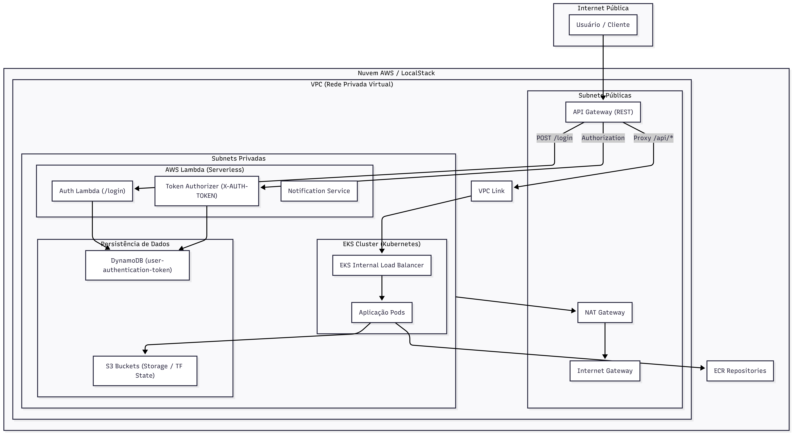
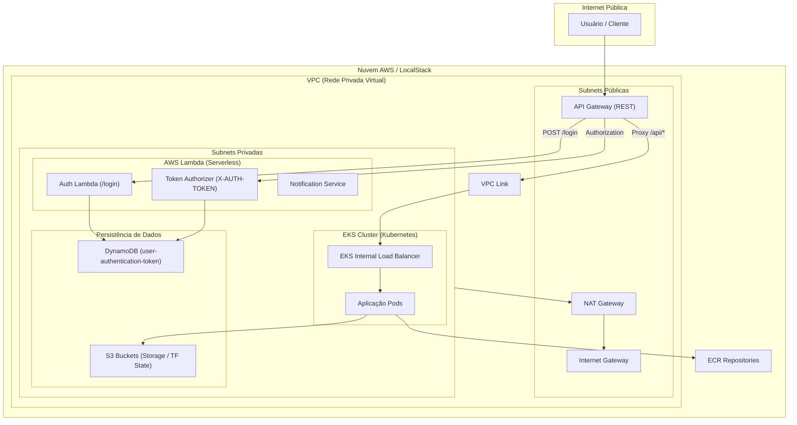

# IaC Tech Challenge - Infraestrutura

Este repositório é responsável pelo provisionamento automatizado da infraestrutura necessária para o Tech Challenge, utilizando Terraform para garantir consistência entre ambientes locais e em nuvem. Ele cria uma arquitetura completa, abrangendo desde a rede (VPC) até serviços gerenciados como EKS (Kubernetes), ECR para registro de containers, S3 para armazenamento persistente e integração com Lambdas para autenticação e autorização via API Gateway.

## Tecnologias Utilizadas

*   **Terraform:** Infraestrutura como Código (IaC).
*   **AWS:** Provedor de nuvem principal.
*   **LocalStack:** Emulação de serviços AWS para desenvolvimento local.
*   **Kubernetes (EKS):** Orquestração de containers.
*   **AWS Lambda:** Execução de funções serverless para autenticação e autorização.
*   **Docker (ECR):** Gerenciamento de imagens de container.
*   **Amazon S3:** Armazenamento de arquivos e estado do Terraform.

## Passos para Execução e Deploy

### Pré-requisitos

*   [Terraform](https://www.terraform.io/downloads.html) (versão >= 1.0.0).
*   [AWS CLI](https://aws.amazon.com/cli/) devidamente configurado.
*   [LocalStack](https://localstack.cloud/) instalado (para execução local).
*   [tflocal](https://github.com/localstack/terraform-local) (opcional, mas recomendado para o LocalStack).

### Execução Local (LocalStack)

Para testar a infraestrutura localmente sem custos na AWS:

1.  Inicie o LocalStack em segundo plano:
    ```bash
    localstack start -d
    ```
2.  Navegue até o diretório `localstack/`:
    ```bash
    cd localstack
    ```
3.  Inicialize o Terraform:
    ```bash
    tflocal init
    ```
4.  Aplique o plano de infraestrutura:
    ```bash
    tflocal apply -auto-approve
    ```

### Deploy Real na AWS

Para realizar o deploy na sua conta AWS real (ou ambiente de laboratório):

1.  Certifique-se de que suas credenciais AWS estão ativas no terminal.
2.  Navegue até o diretório `aws/`:
    ```bash
    cd aws
    ```
3.  Inicialize o Terraform:
    ```bash
    terraform init
    ```
4.  Crie um plano de execução para revisar as mudanças:
    ```bash
    terraform plan
    ```
5.  Aplique as mudanças para criar os recursos:
    ```bash
    terraform apply -auto-approve
    ```

> **Nota Crítica sobre S3 State:** O backend do Terraform para a AWS real utiliza um bucket S3 para armazenar o estado (`.tfstate`). Certifique-se de que o bucket configurado em `main.tf` ou via `backend-config` existe e está acessível.

## Diagrama da Arquitetura

Abaixo está o diagrama visual da infraestrutura provisionada por este repositório.





## APIs (Swagger/Postman)

*(em branco)*
